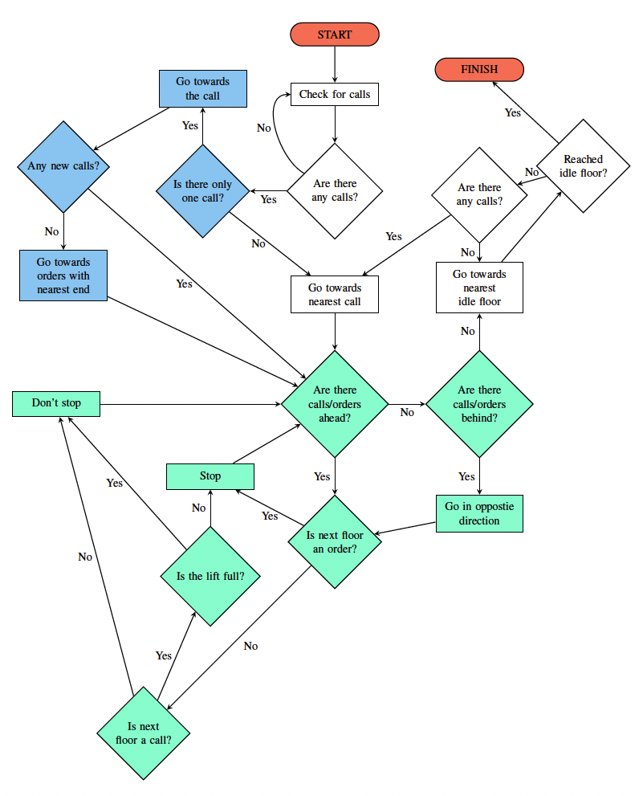

## Lift Simulator

<!-- TABLE OF CONTENTS -->
<details>
  <summary>Table of Contents</summary>
  <ol>
    <li>
      <a href="#about-the-project">About The Project</a>
    </li>
    <li>
      <a href="#built-with">Built With</a>
    </li>
    <li>
      <a href="#getting-started">Getting Started</a>
    </li>
  </ol>
</details>

<!-- ABOUT THE PROJECT -->
## About The Project

* This project simulates a single lift responding to users according to an algorithm minimising wait time. User data is entered either manually or with a csv file, and then the simulation shows how users will be taken to their desired floors.


* Below is the algorithm that the lift uses:



<p align="right">(<a href="#lift-simulator">back to top</a>)</p>

### Built With

* [![React][React-shield]][React-url]
* [![.Net][.Net-shield]][.Net-url]

<p align="right">(<a href="#lift-simulator">back to top</a>)</p>

<!-- GETTING STARTED -->
## Getting Started

To get a local copy up and running, follow these steps.

1. If you don't have Node.js, download and install it from https://nodejs.org/en

2. Update npm
   ```sh
   npm install npm@latest -g
   ```

3. Clone the repo
   ```sh
   git clone https://github.com/ALT-Browne/LiftSimulator.git
   ```

4. Install NPM packages
   ```sh
   npm install
   ```

5. Run the API project
   ```sh
   dotnet run
   ```

6. Run the Client project
   ```sh
   npm run dev
   ```

7. Navigate to the url shown in the terminal

<p align="right">(<a href="#lift-simulator">back to top</a>)</p>

<!-- MARKDOWN LINKS & IMAGES -->
<!-- https://www.markdownguide.org/basic-syntax/#reference-style-links -->
[React-shield]: https://img.shields.io/badge/React-20232A?style=for-the-badge&logo=react&logoColor=61DAFB
[React-url]: https://reactjs.org/
[.Net-shield]: https://img.shields.io/badge/.NET-5C2D91?style=for-the-badge&logo=.net&logoColor=white
[.Net-url]: https://dotnet.microsoft.com/en-us/
